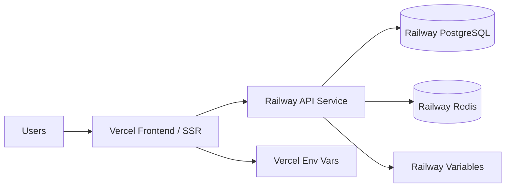

# PaaS Reference: Vercel and Railway

Use these mappings when the user wants the easiest managed path, a startup/demo deployment, a GitHub-connected workflow, or explicitly asks for Vercel, Railway, or a Vercel + Railway split.

## When to choose Vercel

Choose Vercel when the codebase is primarily:

- Next.js, React, Vite, Astro, SvelteKit, Remix, Nuxt, or another frontend/SSR web app.
- A static site, marketing site, documentation site, dashboard UI, or frontend that calls an API elsewhere.
- An app that benefits from preview deployments per pull request.

| Need | Vercel feature | Problem solved | Notes |
|---|---|---|---|
| Static frontend | Vercel static hosting + Edge Network | Fast global web delivery | Good default for frontend-only apps. |
| Next.js SSR | Vercel Functions / Edge Functions | Runs SSR/API route logic | Check timeout, region, and cold-start constraints. |
| Preview deploys | Git integration | Review every PR before merge | Strong reason to use Vercel for teams. |
| Environment variables | Vercel Project Env Vars | Stores app config/secrets | Separate production, preview, and development envs. |
| Domains/TLS | Vercel Domains | Custom domain and HTTPS | Include DNS steps. |
| Observability | Vercel logs/analytics | Frontend and function visibility | May need external APM for backend depth. |

## When to choose Railway

Choose Railway when the codebase needs a simple backend/data platform:

- API server, worker, bot, websocket service, or containerized backend.
- PostgreSQL/Redis and simple managed service provisioning.
- `Dockerfile`, `Procfile`, Express/FastAPI/Django/Rails/Laravel/Spring/Go service.
- A small production or demo setup where full AWS/Azure/GCP is too heavy.

| Need | Railway feature | Problem solved | Notes |
|---|---|---|---|
| API/backend | Railway service | Runs long-lived server processes | Good for REST APIs, workers, bots, and websocket apps. |
| Container runtime | Dockerfile/Nixpacks | Builds and runs app with minimal config | Confirm start command and healthcheck. |
| Database | Railway PostgreSQL / Redis | Managed data dependency | Plan backups and production data controls. |
| Secrets | Railway variables | Runtime config/secrets | Never commit `.env`; map required variables. |
| Networking | Public/private service networking | Connects frontend/backend/database | Document service URLs and internal networking. |
| Logs/metrics | Railway observability | Basic operations visibility | Add external monitoring for serious production. |

## Common Vercel + Railway architecture

Use this split for many full-stack apps:

Recommended package contents for Vercel + Railway:

- `README_DEPLOY.md` with separate Vercel and Railway setup sections.
- `vercel.json` when the output directory/build command is non-standard.
- Railway service settings: start command, build command, healthcheck path, variables, and database attachments.
- GitHub Actions only if extra checks are needed; both platforms can deploy directly from GitHub.
- `env.example` listing required variables without secret values.

## PaaS cautions

- Do not force Terraform unless the user asks; PaaS deployments often need project settings and clear runbooks more than IaC.
- Check platform limits: function timeouts, websocket support, background jobs, cron, file system persistence, regions, and data backup needs.
- If the app handles regulated data, high traffic, strict networking, or enterprise controls, compare PaaS against AWS/Azure/GCP managed services.
- For file uploads, prefer object storage (S3/R2/GCS/Azure Blob) rather than relying on ephemeral runtime storage.
